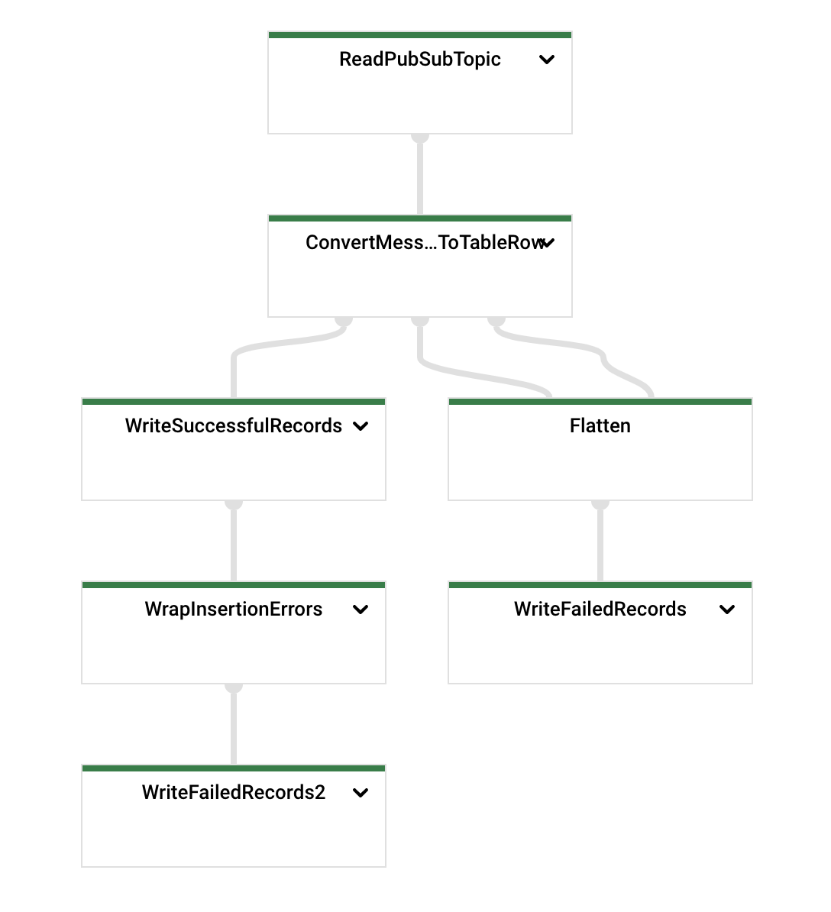

<walkthrough-project-setup>
</walkthrough-project-setup>

# GCP游戏分析解决方案
## 概述
常见的游戏分析系统架构如下图所示，一般会包含以下几个部分：
1. 游戏客户端：采集游戏日志、打点信息后，以实时或非实时方式发送到采集模块
2. 采集模块：认证游戏客户端，接收日志和打点信息，将接收到的数据存储到对应数据库或数据仓库
3. 分析系统：对数据进行ETL，将不同类型的数据处理后存放至不同类型的数据存储，计算汇总信息
4. 展现模块：根据业务关心的指标制作图表，可视化展现数据结果


## GCP架构
为了演示如何在GCP进行游戏数据分析，设计了一个简单的架构用于展示如何从游戏客户端采集数据，如何将数据实时发送至服务端，如何实时存储和处理数据并进行可视化展现。


此架构包含两类数据的采集和处理：用户事件的实时处理和日志的批量处理。

#### 用户事件实时处理

用户登陆游戏、购买虚拟资产、充值等行为我们将其定义为`事件`,除上述通用行为外，我们还可为特定游戏定义特定的事件，如：用户升级、加入工会、获得装备等。如何定义游戏事件，请参考：[Google Analytics推荐事件](https://support.google.com/firebase/answer/9267735?hl=zh-Hans&ref_topic=6317484)  和 [GA推荐的游戏事件](https://support.google.com/firebase/answer/9267565?hl=zh-Hans)

用户事件具有实效性，如果能尽快的采集和处理用户事件，能改善用户体验，提高玩家留存率。例如：当玩家卡在某一关卡无法过关，当服务端接收到几条事件后，为玩家提供过关指引。

[Cloud Pub/Sub](https://cloud.google.com/pubsub) 为玩家事件采集提供了托管的消息队列服务，游戏客户端集成SDK之后可将玩家事件发送至Cloud Pub/Sub。Cloud Pub/Sub是一个全球化的服务，Google在全球范围跟大多数网络服务提供商(ISP)都有peering，无论玩家所在何处，都能够快速的将玩家事件发送到Cloud Pub/Sub。

玩家事件发送到Cloud Pub/Sub之后，通过[Dataflow](https://cloud.google.com/dataflow) 作为消费者获取数据，进行ETL操作之后保存到[BigQuery](https://cloud.google.com/bigquery) 。整条处理采集和处理的管道(Pipeline)不需要游戏开发者部署服务器来安装应用，免去了运维负担。并且数据管道的处理能力可以根据玩家事件数据量的变化而弹性扩展，让游戏开发者按使用量付费。使用[Dataflow](https://cloud.google.com/dataflow) 而非Spark或Flink，因为前者能提供批流一体的能力，并且能对流式处理提供更好的时序支持。

#### 服务器日志实时/批量处理

对于服务器产生的日志，可以实时处理，也可以批量处理。通过在服务器上“侧加载”一个日志收集的组件，如flume或[fluent-bit](https://fluentbit.io/) ,便可将服务器日志传输到[Cloud Logging](https://cloud.google.com/logging) 服务，然后将日志路由至其他服务进行处理。

## 安装部署
本demo采用容器化技术，将用户事件模拟器和服务器模拟器都封装成为容器，并以K8S技术对容器进行编排。先将repo代码pull到本地

```shell
export project_id=`gcloud config get-value project`
git pull https://github.com/ykzj/gaming-analytics.git
cd gaming-analytics
```

repo中目录结构如下图:


### 用户事件模拟器

stream目录中包含用户事件模拟器及对应的yaml文件，部署之前先通过Dockerfile生成容器镜像

```shell
cd stream
gcloud builds submit --tag gcr.io/${project_id}/simulator:0.3
```

##### (可选)

如果需要在本地验证容器的运行情况，可以替换run.sh中的内容，并在本地执行，观察容器运行日志。如果容器能在本地正常运行，再将容器push到[Container Registry](https://cloud.google.com/container-registry) 中。

构建好容器镜像之后，push到[Container Registry](https://cloud.google.com/container-registry) 中

```shell
gcloud auth configure-docker
docker build -t simulator .
docker tag simulator gcr.io/${project_id}/somulator:0.3
docker push gcr.io/${project_id}/somulator:0.3
```

### 服务器日志模拟器

batch目录中包含服务器日志模拟器及对应的yaml文件，部署之前先通过Dockerfile生成容器镜像
```shell
cd ../batch
gcloud builds submit --config=gameserver.yaml
gcloud builds submit --config=fluent-bit.yaml
```
##### (可选)

如果需要在本地验证容器的运行情况，可以替换run.sh中的内容，并在本地执行，观察容器运行日志。如果容器能在本地正常运行，再将容器push到[Container Registry](https://cloud.google.com/container-registry) 中。

构建好容器镜像之后，push到[Container Registry](https://cloud.google.com/container-registry) 中

```shell
docker build -t gameserver -f Dockerfile.gameserver .
docker build -t fluent-bit -f Dockerfile.fluent-bit .
docker tag gameserver gcr.io/${project_id}/gameserver:0.2
docker push gcr.io/${project_id}/gameserver:0.2
docker tag fluent-bit gcr.io/${project_id}/fluent-bit:1.8
docker push gcr.io/${project_id}/fluent-bit:1.8
```
至此，用户事件模拟器和服务器日志模拟器的镜像制作完成。

### 创建Google Kubernetes Engine集群

接下来创建一个[GKE](https://cloud.google.com/kubernetes-engine) 集群，用来运行用户事件模拟器和服务器日志模拟器。用户事件模拟器将模拟事件发送到Pub/Sub服务，服务器日志模拟机将日志发送到Cloud Logging服务，因此需要先创建一个服务账号，并授予Pub/Sub服务和Cloud Logging服务的权限。

```shell
gcloud iam service-accounts create gaming-analytics-demo \
            --display-name="Gaming Analytics Demo"

gcloud projects add-iam-policy-binding ${project_id} \
            --member=serviceAccount:gaming-analytics-demo@${project_id}.iam.gserviceaccount.com \
            --role=roles/pubsub.publisher

gcloud projects add-iam-policy-binding ${project_id} \
            --member=serviceAccount:gaming-analytics-demo@${project_id}.iam.gserviceaccount.com \
            --role=roles/logging.logWriter
            
gcloud projects add-iam-policy-binding ${project_id} \
            --member=serviceAccount:gaming-analytics-demo@${project_id}.iam.gserviceaccount.com \
            --role=roles/storage.objectViewer
```

 创建好服务账号之后，创建一个新的GKE集群，并给node赋予新建的服务账号:
```shell
gcloud beta container --project ${project_id} clusters create "gke-gaming-analytics-demo" --zone "us-central1-c" --no-enable-basic-auth --cluster-version "1.19.12-gke.2100" --release-channel "stable" --machine-type "e2-medium" --image-type "COS_CONTAINERD" --disk-type "pd-standard" --disk-size "100" --metadata disable-legacy-endpoints=true --service-account "gaming-analytics-demo@${project_id}.iam.gserviceaccount.com" --max-pods-per-node "110" --num-nodes "3" --enable-stackdriver-kubernetes --enable-ip-alias --network "projects/${project_id}/global/networks/default" --subnetwork "projects/${project_id}/regions/us-central1/subnetworks/default" --no-enable-intra-node-visibility --default-max-pods-per-node "110" --enable-autoscaling --min-nodes "0" --max-nodes "10" --no-enable-master-authorized-networks --addons HorizontalPodAutoscaling,HttpLoadBalancing,GcePersistentDiskCsiDriver --enable-autoupgrade --enable-autorepair --max-surge-upgrade 2 --max-unavailable-upgrade 0 --enable-shielded-nodes --node-locations "us-central1-c"
```

等待几分钟，GKE集群创建好后，获取身份验证以便与集群交互：
```shell
gcloud container clusters get-credentials gke-gaming-analytics-demo
```
通过下列命令验证kubectl命令行能正常获取集群信息：
```shell
kubectl get po
kubectl get node
```
### 创建Cloud Pub/Sub Topic
在部署应用到GKE之前，还需要先创建一个Cloud Pub/Sub Topic用来接收用户事件模拟器的模拟事件：
```shell
gcloud pubsub topics create gaming-analytics-topic
```
### 部署应用到GKE
接下来可以开始部署用户事件模拟器和服务器日志模拟器到GKE集群，注意：在部署前调整yaml文件配置以匹配project id、Pub/Sub topic等设置。
```shell
cd ../stream
kubectl create -f simulator-deployment.yaml
cd ../batch
kubectl create -f gameserver-deployment.yaml
```

如果需要调整模拟器的数量，请修改yaml文件中的对应设置。

### 创建BigQuery数据集

通过bq命令行工具来创建一个数据集，用于存储用户事件和服务器日志：

```shell
bq --location=US mk -d \
--default_table_expiration 3600 \
--description "Gaming Analytics demo dataset." \
gaming_analytics
```

创建两张表用于存储具体内容，用于存储用户事件的events表的schema定义文件在stream目录下：
```shell
cd ../stream

bq mk \
  --table \
  --expiration 3600 \
  --description "user events" \
  gaming_analytics.events \
  event_table_schema.json
```

### 创建Dataflow任务

Dataflow用于消费Pub/Sub数据后存入BigQuery，得益于Dataflow自带的Pub/Sub Topic to BigQuery任务模版，我们只需要从模版创建任务即可，不需要自己写代码来实现,只需要创建一个存储桶用于任务执行的临时存储。此任务的DAG如下图：


执行下列命令：
```shell
gsutil mb gs://${project_id}

gcloud dataflow jobs run job-gaming-analytics --gcs-location gs://dataflow-templates-us-central1/latest/PubSub_to_BigQuery --region us-central1 --staging-location gs://${project_id}/temp --parameters inputTopic=projects/${project_id}/topics/gaming-analytics-topic,outputTableSpec=${project_id}:gaming_analytics.events
```

等待job创建完成后，通过bq命令行查询events表以获取结果
```shell
bq query --use_legacy_sql=false \
'SELECT
  *
FROM
  gaming_analytics.events
LIMIT 10'
```

至此，用户事件模拟器生成的模拟事件已经经过流式处理，并且存储到BigQuery表里。

### 存储服务器日志到BigQuery

服务器日志模拟器生成的模拟日志已经自动发送到Cloud Logging中，接下来我们创建一个sink:
```shell
gcloud logging sinks create sink-gaming-analytics \
bigquery.googleapis.com/projects/${project_id}/datasets/gaming_analytics \
--log-filter='resource.type="k8s_container" resource.labels.cluster_name="gke-gaming-analytics-demo" resource.labels.namespace_name="default" resource.labels.container_name="fluent-bit"'
```

命令完成后，会在BigQuery的gaming_analytics数据集下自动创建一张表，用来存放服务器日志信息

## 清理

为了避免产生额外的费用，实验完成后请删除实验过程中创建的资源：
```shell
cd ..
kubectl delete -f stream/simulator-deployment.yaml
kubectl delete -f batch/gameserver-deployment.yaml
gcloud container clusters delete gke-gaming-analytics-demo
gcloud logging sinks delete sink-gaming-analytics
export job_id=`gcloud dataflow jobs list --region=us-central1 --status=active --filter="name=job-gaming-analytics" | tail -n 1 | cut -f 1 -d " "`
gcloud dataflow jobs cancel $job_id --region=us-central1
gcloud pubsub topics delete projects/${project_id}/topics/gaming-analytics-topic
bq rm -r -f -d ${project_id}:gaming_analytics
gcloud iam service-accounts delete gaming-analytics-demo@${project_id}.iam.gserviceaccount.com
gcloud container images delete gcr.io/${project_id}/fluent-bit:1.8
gcloud container images delete gcr.io/${project_id}/gameserver:0.2
gcloud container images delete gcr.io/${project_id}/simulator:0.3
```